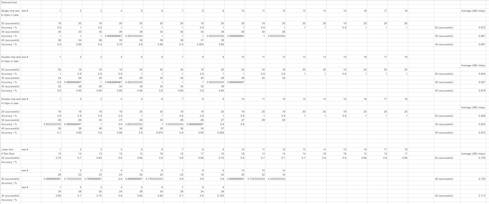

# ChipDispenser

Here is Tianyang's Lab notebook.
This notebook denotes all the work Tianyang did for the project.

 ## Jan.30th,2023
We receive the diea from TA to make a machine that could find parts in a pile of electronic parts using sensors.\
We were thinking about seperating electronic components using characteristics like weight, size, shape and magnetism.\
This idea seems to be promising. We decided to have a meeting tomorrow to discuss further detail.

## Jan.31st,2023
Instead of chip selecting machine, I proposed the idea of chip storage system that would idetify and sort chips from input port and dispense chips at output port.\
We concider text recognition and solenoid could be used on input port. Solenoid could be used to push chips on output port.\
We decided to go to a TA for advice about this idea before RFA.

## Feb.1st,2023
I went to the lab ECEB 2070. There I talked to the advicor about our idea.\
Instead of text recognition, suggested by TA, QR code or bar code scanning could be a better way.\
However, none of us are familier with all recognition techniques listed above.\
We decided to search for materials about these techniques.

## Feb.7th,2023
We draw the block diagram together about this project and went to a meeting with TA.\
Here is the raw and earlist versoin of block diagram and high level review:\
\
We received posititive feedback and suggestions from TA and decided to go to machine shop the next day.

## Feb.8th,2023
We went to machine shop. Gregg said we our system were too complicated. Sorting plus dispending could take extream amount of time.\
Being told that, we decided to focus on the dispending part. Hanging chip storage tube in the air and let solenoid knock the very botton chip became sour solution for dispenser.\
Project proposal was started today.

## Feb.9th,2023
Project proposal was done. I worked on introduction and tolerance analysis part.

## Feb.19th,2023
We had another meeting with TA. We talked to him the feedback from machine shop. TA agree that we should focus on dispener first.

## Feb.21th,2023
I picked the solenoid set from Amazon. It requires 12V and 210mA.

## Mar.7,2023 ~ Mar.20,2023
Did not attend much work due to personal reason.[1]

## Mar.28th,2023
We received the PCB board and all other components orded.

## Mar.30th,2023 ~ Mar.31st,2023
Fulfilled the design document review.\
I worked on subsystem:dispensing system and power supply, graph & table arrangement, safety, ethic, schedule and reference

## Apr.5th,2023 ~ Apr.18th,2023
Did not attend much work due to personal reason.[1]

## Apr.21st,2023
Attended mock demo. received suggestions from TA that we should replace our LCD screen and try to set up physical part for demonstration.\
Completed team contract fulfillment. I worked on team issues and structual arrangement.

## Apr.22nd,2023
We DIYed the physical or machenical part for our project. I worked on solenoid and storage tube arrangememnt.\
We found that our solenoid was not powerfull enough to knock chips away with high accuracy. Chips stucking was the mian issue.\
After modifying the circuit to add capacitor inside, the dispensing accuracy increased quiet a lot.\
We also found that making the platform smoother could increase the accuracy.\
The accuracy increased from around 50% to 90%, we decided to do the verification test the next day after we setup the laser sensor.

## Apr.23rd,2023
I setup the laser sender and receiver to the actual position. My teammates merged all the code for different subsystems.\
Before doing the test, the laser sensor accuracy was low.\
We tried different positions. Even the best position we found was not good enough.\
Considering we do not have much time left, we decided to continue and do the verification test.\
Here what the dispenser look like finally:\
\
We used three different loading sizes: 20,30 and 40 chips.\
There were also three dispending configurations: dispense 1,2 and 3 chips at a time.\
On each loading size and dispending configuration, we did 360 tests (dispending processes).\
We recorded the data in a EXCEL file. Here is a screenshot for the test data.\
\

## Apr.24th,2023
We did the final demo today.\
It seems like we accidentally burned one LCD screen just before the demo.\

## Apr.30th,2023
The slides for final presentation was done.\
I worked on problems and solution part, summary part, further improvement part and ethical concerns part.\

## May.1st,2023
We did the final presentation.

## May.2nd,2023~May.3rd,2023
We worked and completed the final report.\
I did introduction, verification, summary and ethics parts.

### [1] I will explain my personal reason in this part.
I got desease in early March. After visiting Mckinley and Carle, I recoverd and went back on group project.\
However, in early April, it recured. I was sent to operating room.\
Because of that I was unable to work during those periods.
