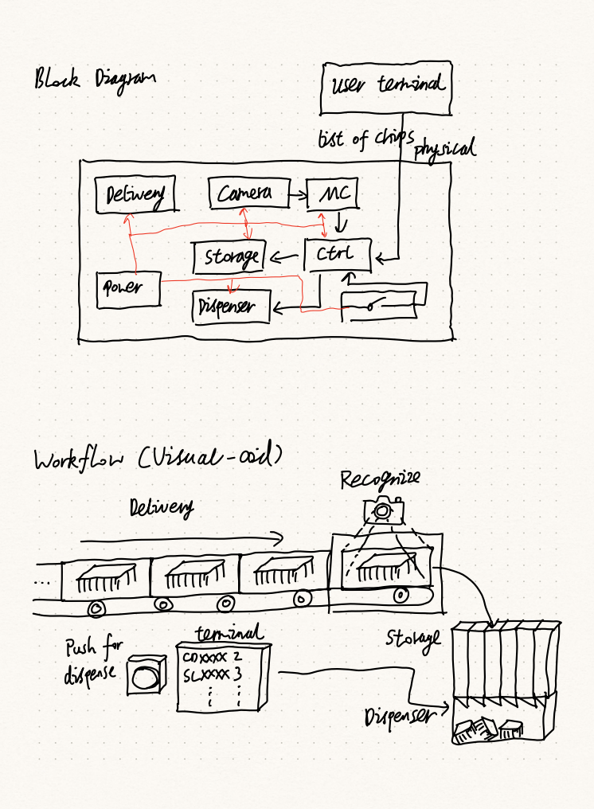
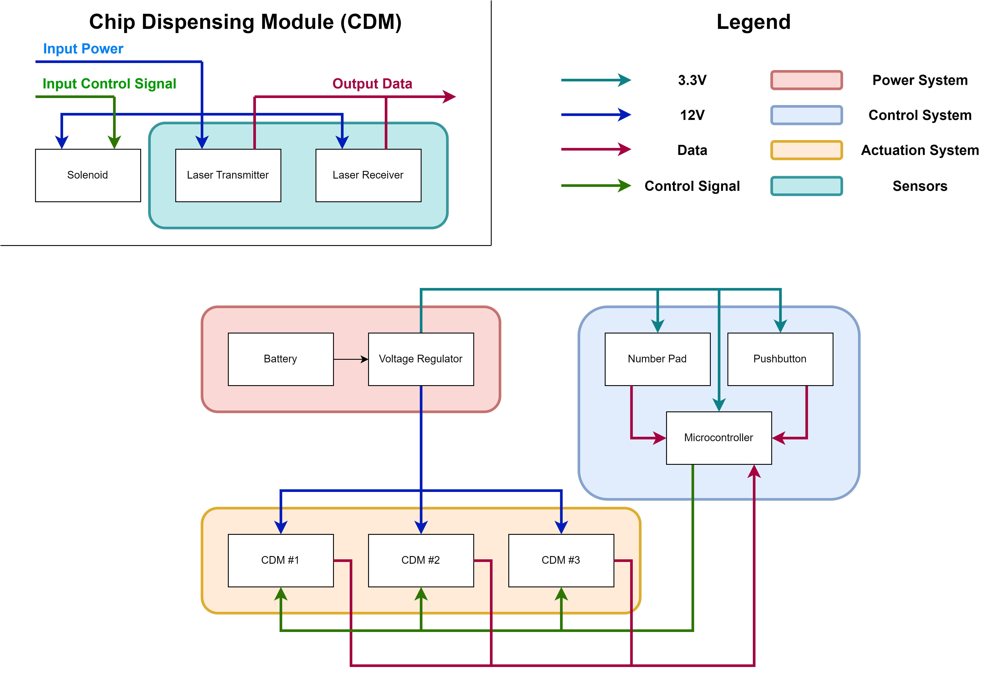
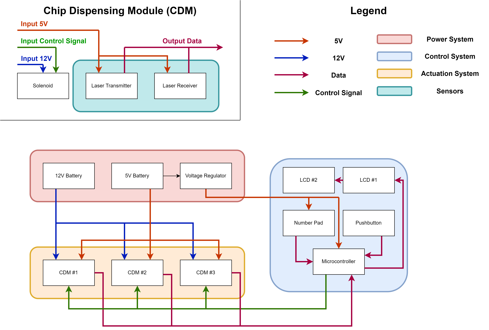
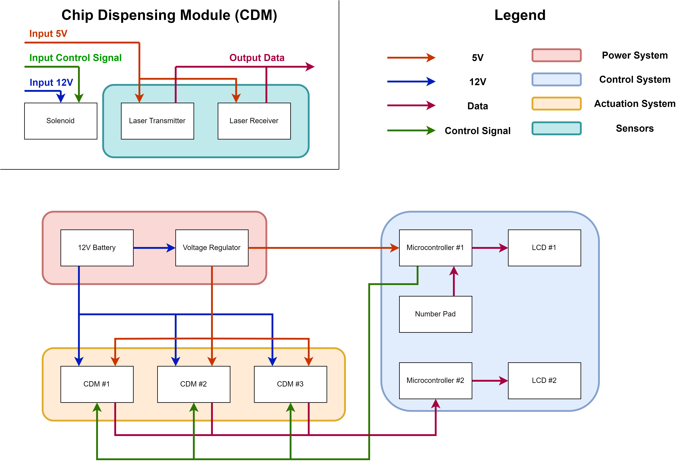
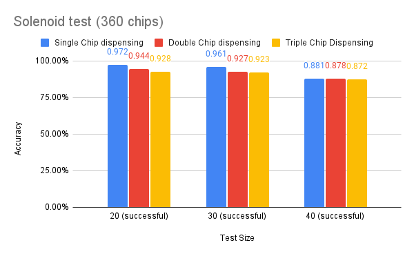
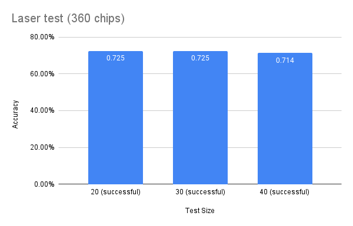
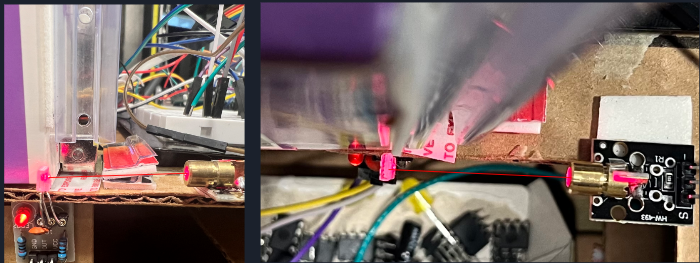

# ECE 445 TEAM65 xulunh2
Notes for ideas and implementation of the Senior Design Project

## CHIP DISPENSER

## Group Meeting 01/30
We met at Tianyang's apartment at 7pm to discuss our idea about the dispenser. We think it's a good idea to develop such a machine that can alleviate the pressure of manual separation of different electronic parts. 

## Group Meeting 01/31
We have decided to make a dispenser that focusing on dispensing chips after discussion. We think it is difficult to tell among the chips because they share similar sizes and shapes. We want to first scan the chips using high resolution cameras that could tell the serial number on the chips, so that we can separate a bunch of mixed chips into clear and separated piles. 

## Group Meeting 02/03
We further discussed the details of the project. We proposed many blocks of functions that could be potential candidates for the project. First is a delivery system, which includes a transportation belt that we need to talk with the machine shop about. We also proposed details about the chip id system and chip dispensing system, but the concern is that the cost of the project might be too high. Here is the Visual Aid we have. 

## TA advice and Machine shop visit 02/08
We met with our TA Raman and talked about the details of the project. Our TA is generally approved of the project and offered some advice in designing the delivery system. Then we went down the machine shop to talk to the staff there about our ideas and implementation. Staff member there suggested that the project was composed of too many parts and that we should focus on only the dispensing system. He also showed us the solenoids he had on hand that we could find useful to implement such a project. 

## Project Proposal Completion 02/09
After taking the advice from yesterday, we round our system down to the dispensing part only. We separated it into 5 subsystems: Storage, Dispensing, Power, User Terminal and control. I wrote the Ethics and Safety part of the project proposal. Here is our official Block Diagram.

## Design Document Completion 02/20
TA said that he finds our initial proposal lacking many things like proper high-level requirements and specific calculation for our designs. Also the cost of the design was not included. As a result, I did the power consumption analysis, refined the ethics and safety part of the document, and discussed future schedule about the implementation and the division of work among the members and so forth. 

## Purchasing Components 03/08 
I placed purchase on myece for the parts needed for the project using the funds. 

## Laser Testing 03/21-23
I started to test the laser module, including the arduino board connections with the laser receiver. Started to implement the design of the laser module following the design document. 

## Laser Coding 03/23-28
I implemented the coding for the laser, to ensure that whenever a chip passes the receiver, it would be read and only read once. Also all the information needed for the control system is output in the arduino software for further use. 

## Group Meeting in Lab 03/29
We identified many issues with the system when combining them together. First is that the cdm is not powered enough; also the laser module I worked on had no problem detecting fingers, but had problems with chips. We did many adjustment to the system to further improve the results. I modified my code and readjusted the positioning of the lasers and their receivers, and the accuracy improved by around 20 percent. Also the LCD screen is not working so we had to order another one. 

## Week 04/03-04/07
With one of our teammate ill, we tested the actuation module and user terminal module as well. We found the keyboard we had for the user terminal requires too much power, so we switched to a simpler numpad. We developed coding for the numpad and control system. Block Diagram was updated: 

## Week 04/10-04/14
We combined different parts of the system together to do more tests before the mock demo. The PCB didn't work well, so we had to go on testing on the breadboard first. We also decided to use two LCDs and two microcontrollers instead of one for more convenient integration of the project. The new block diagram is 

## Group Meeting 04/22
After the mock demo, our teammate Tianyang recovered and returned to the team. We all worked hard together for the final demo. We first try to improve the solenoids, because the solenoids fail to function when too many chips are stacked. Qi proposed to add a capacitor to increase the power output and it improved the result. The result of the test is shown here:  

## Group Meeting 04/23
We gave out different ideas on how the laser and its receiver should be set up to better detect the chip drops. Different positions were tried and no obvious improvements have been shown. I made sure the coding worked correctly, so it was mainly a mechanical issue that we could not solve properly. The test result is as follows: and the module looked like this: 

## Final Demo 04/24
Burned a LCD just before the demo, but we managed with just one.

## Final Presentation 05/01

## Final Report 05/02
I wrote the second part of the report, which is the design of the project
